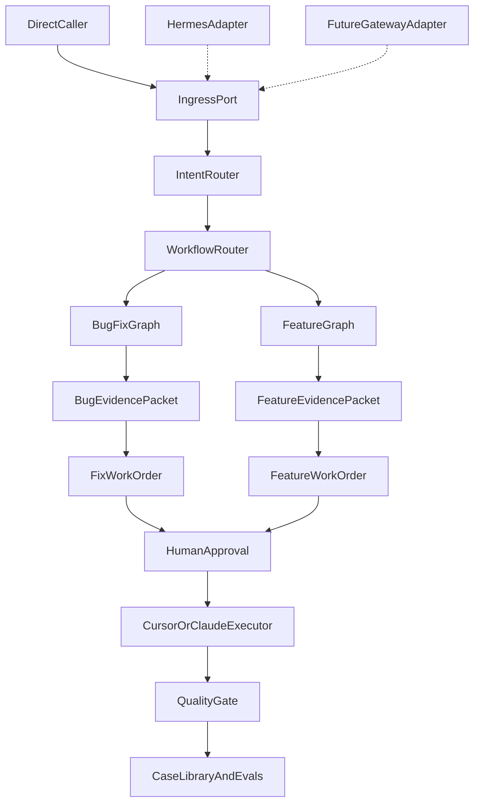

# Delivery Ops Agent

Delivery Ops Agent 是一个面向交付团队的工作流 Agent。它负责读取 Bug、需求、PRD、Figma 和代码上下文，生成可信证据包与可执行工单，并在确认后把低/中风险任务交给 Cursor SDK 或 Claude Code 执行。

它不是全自动程序员。它的核心价值是把 Bug Fix 和 Feature Development 的交付流程标准化：取数、建证据、生成工单、执行、独立验收、沉淀案例。

## 为什么做

交付任务的问题通常不在“能不能写代码”，而在上下文分散、需求和设计不一致、Bug 证据不足、工单不可执行、执行结果缺少独立验收。

Delivery Ops Agent 解决这些问题：

- 自动聚合业务系统、PRD、Figma、代码仓库中的上下文。
- 将 Bug Fix 与 Feature Development 拆成两条隔离工作流。
- 用 Evidence Packet 先记录事实，再生成 Work Order。
- 用 Quality Gate 独立验收执行结果。
- 将历史任务沉淀为 Case Library 和 Evals。

## 架构

## 工作流

Bug Fix 工作流关注复现问题、对比 PRD/Figma/历史正确行为、限制 diff 范围和防止回归。

Feature Development 工作流关注需求就绪度、PRD 验收标准、Figma 状态、依赖映射、范围控制和可测试性。

两条工作流可以复用 Adapter、存储、执行器、报告等基础设施，但不能复用任务状态、证据模型、工单模板、风险策略和验收门禁。

## 入口策略

首期使用直接调用，不先自研完整消息网关。

- `DirectInvocationAdapter`：首期真实入口，可用于 CLI、本地脚本、测试或内部 API 调用。
- `IngressPort`：核心 Agent 依赖的稳定输入边界。
- `HermesAdapter`：后续作为消息通道 Adapter 接入。
- `FutureGatewayAdapter`：仅作为未来自研 Gateway 的占位。

现在自研完整 Gateway 会额外引入平台协议、签名鉴权、回调重试、用户映射、附件处理、交互消息、限流和审计等工作。它后续有价值，但不是当前 MVP 的核心。

## 技术栈

- Python 3.10+
- FastAPI
- LangGraph
- Pydantic
- SQLModel 或 SQLAlchemy
- Redis 或任务队列
- Cursor SDK / Claude Code Adapter

## 路线图

- Phase 1：基础设施与直接调用入口
- Phase 2：Bug Fix 只读 MVP
- Phase 3：Feature Development 只读 MVP
- Phase 4：Cursor SDK / Claude Code 执行器
- Phase 5：Quality Gate
- Phase 6：Case Library 与 Evals

## 实现文档

架构和阶段实现文档：

- `docs/architecture/project-structure.md`
- `docs/implementation/phase-01-foundation.md`
- `docs/implementation/phase-02-bugfix-readonly-mvp.md`
- `docs/implementation/phase-03-feature-readonly-mvp.md`
- `docs/implementation/phase-04-executor.md`
- `docs/implementation/phase-05-quality-gate.md`
- `docs/implementation/phase-06-case-library-evals.md`

## 设计原则

- 平台集成都放在 Adapter 后面。
- Bug Fix 与 Feature Development 保持为两条独立 LangGraph 子图。
- 先构建证据，再生成执行工单。
- Cursor SDK 和 Claude Code 只做执行器，不做裁判。
- 中风险任务执行前必须人工确认。
- 高风险任务不自动执行。
- 保留任务审计记录，用于 review 和 evals。
