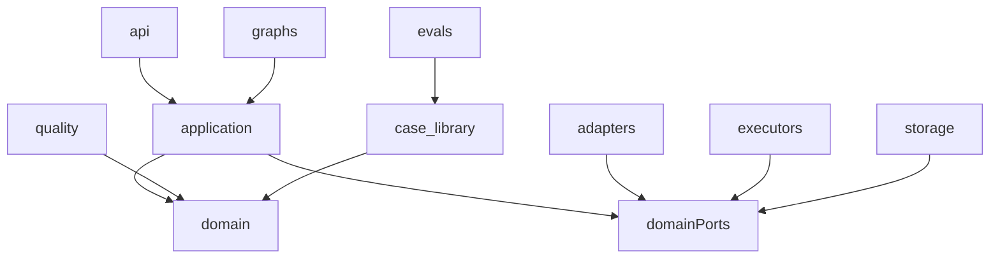

# Project Structure

Delivery Ops Agent 使用 `src/delivery_ops/` 标准 Python 包布局。源码、文档、Agent skills、测试、运行配置需要明确隔离，避免后续 FastAPI、LangGraph、执行器、验收层和案例库混在一起。

## 目录总览

```text
delivery-agent/
  src/
    delivery_ops/
      __init__.py
      api/
      adapters/
      application/
      domain/
      graphs/
      quality/
      executors/
      storage/
      case_library/
      evals/
      config/
      observability/
  tests/
    unit/
    integration/
    contract/
    evals/
  docs/
    architecture/
    implementation/
    agent-skills/
  .cursor/
    skills/
  .claude/
    skills/
  .agents/
    skills/
  pyproject.toml
  README.md
```

## 为什么使用 `src/delivery_ops`

- 避免测试时误从项目根目录导入未安装源码。
- 适合后续打包、CLI、worker、API 多入口。
- 与 `docs/`、`.cursor/skills`、`.claude/skills`、`.agents/skills` 等非源码目录隔离。
- 更容易配置 pytest、ruff、mypy、coverage。
- 让 import 路径稳定为 `delivery_ops.*`。

## 源码目录职责

### `api/`

FastAPI HTTP 边界。只负责请求解析、响应模型、依赖注入和错误映射。

建议子目录：

```text
api/
  routes/
  dependencies.py
  error_handlers.py
  app_factory.py
```

规则：

- 不写业务判断。
- 不直接调用外部平台 SDK。
- 只调用 `application/` 的用例服务。

### `adapters/`

外部系统接入层。所有平台协议、SDK、HTTP client、payload 解析都放这里。

建议子目录：

```text
adapters/
  ingress/
    direct_invocation.py
    hermes.py
    future_gateway.py
  bug_sources/
  requirements/
  prd/
  design/
  repo/
```

规则：

- 首期只实现 `direct_invocation.py` 和 Fake/InMemory adapters。
- `hermes.py` 后续接入，不作为 Phase 1 必做。
- 平台 payload 必须转换成 `domain/` 模型后再进入核心流程。

### `application/`

用例服务层。承载可测试的业务流程，但不依赖具体平台 SDK。

建议子目录：

```text
application/
  ingress_service.py
  intent_router.py
  workflow_router.py
  evidence/
  risk/
  work_orders/
  approvals/
  reports/
```

规则：

- 依赖 `domain/` 模型和 `domain/ports.py` 协议。
- 通过依赖注入接收 adapters、storage、executors。
- 生成 Evidence Packet、Work Order、Risk Assessment、Agent Report。

### `domain/`

纯领域模型和接口定义。不能依赖 FastAPI、LangGraph、SQLAlchemy、外部 SDK。

建议子目录：

```text
domain/
  messages.py
  intents.py
  tasks.py
  bugfix.py
  features.py
  evidence.py
  work_orders.py
  risk.py
  quality.py
  ports.py
```

规则：

- 使用 Pydantic v2 模型和枚举。
- 使用 `Protocol` 定义端口。
- 不出现平台专有字段，例如 Hermes 原始事件结构、TAPD 原始响应、Figma API 原始 payload。

### `graphs/`

LangGraph 编排层。只负责状态机、节点连接、条件路由和 human-in-the-loop checkpoint。

建议子目录：

```text
graphs/
  bugfix/
    state.py
    nodes.py
    graph.py
  feature/
    state.py
    nodes.py
    graph.py
  shared/
    checkpoints.py
    routing.py
```

规则：

- `bugfix/` 和 `feature/` 必须隔离。
- Graph 节点调用 `application/` 服务。
- 不在 Graph 节点里直接调用平台 SDK。
- 所有循环必须有退出条件或最大步数。

### `quality/`

独立验收层。执行器完成后，Quality Gate 判断是否通过。

建议子目录：

```text
quality/
  router.py
  bug_verification.py
  feature_acceptance.py
  diff_scope.py
  test_results.py
  follow_up.py
```

规则：

- Cursor SDK 和 Claude Code 不能自证成功。
- Bug Fix 使用 `BugVerificationGate`。
- Feature Development 使用 `FeatureAcceptanceGate`。
- 验收状态只允许 `pass`、`fail`、`needs_human_review`、`blocked`。

### `executors/`

代码执行层。负责 Cursor SDK、Claude Code、workspace 隔离和执行结果收集。

建议子目录：

```text
executors/
  router.py
  cursor_sdk.py
  claude_code.py
  workspace.py
  test_runner.py
  execution_tracker.py
```

规则：

- 只消费 Work Order。
- 只返回 Execution Result、Diff Summary、Test Result。
- 不决定验收是否通过。

### `storage/`

持久化层。负责任务状态、审计事件、执行记录和报告存储。

建议子目录：

```text
storage/
  task_store.py
  audit_log.py
  repositories/
  migrations/
```

规则：

- 通过 `domain/ports.py` 暴露接口。
- SQLModel/SQLAlchemy 模型不泄漏到 `domain/`。
- Phase 1 可先用 InMemory 实现。

### `case_library/`

历史案例库。保存 Bug Fix 和 Feature Development 的完整任务轨迹。

建议子目录：

```text
case_library/
  recorder.py
  bugfix_cases.py
  feature_cases.py
  conflict_records.py
  metrics.py
```

规则：

- 与执行链路解耦。
- 消费 Task、Evidence、Work Order、Execution Result、Quality Report。
- 为后续 Evals 提供样本。

### `evals/`

评估集与评估运行逻辑。

建议子目录：

```text
evals/
  dataset_builder.py
  runners.py
  scoring.py
  reports.py
```

规则：

- 不直接影响生产决策。
- 评估 ranker、retriever、work order compiler、quality gate。

### `config/`

配置和环境变量。

建议文件：

```text
config/
  settings.py
  environment.py
```

规则：

- 所有环境变量读取集中在这里。
- 不在业务代码里直接读 `os.environ`。

### `observability/`

日志、trace、metrics。

建议文件：

```text
observability/
  logging.py
  tracing.py
  metrics.py
```

规则：

- 不把观测逻辑散落到业务模块。
- 后续可接 LangSmith、OpenTelemetry 或自有日志平台。

## 测试目录映射

```text
tests/
  unit/
    domain/
    application/
    graphs/
    quality/
  integration/
    api/
    storage/
    adapters/
  contract/
    bug_sources/
    requirements/
    prd/
    design/
    repo/
  evals/
```

规则：

- 单元测试优先覆盖 `domain/`、`application/`、`quality/`。
- Graph 测试验证状态流转和条件路由。
- Adapter contract 测试验证外部平台响应到领域模型的转换。
- Evals 测试不阻塞常规单元测试，单独执行。

## 依赖方向



依赖规则：

- `domain/` 不依赖任何其他项目层。
- `application/` 只依赖 `domain/` 和端口接口。
- `api/`、`graphs/` 调用 `application/`。
- `adapters/`、`executors/`、`storage/` 实现端口接口。
- 外部 SDK 只允许出现在 `adapters/`、`executors/`、`storage/`。
- `quality/` 独立于 executor，不从 executor 接受“已通过”的结论。

## Phase 落地顺序

### Phase 1 必建

```text
src/delivery_ops/
  __init__.py
  adapters/ingress/
  application/
  domain/
  graphs/bugfix/
  graphs/feature/
  storage/
  config/
tests/unit/
tests/integration/
```

Phase 1 只需要 Fake/InMemory 实现，保证直接调用、意图识别、工作流路由、任务快照和报告返回能跑通。

### Phase 2 扩展

- `adapters/bug_sources/`
- `application/evidence/`
- `application/risk/`
- `application/work_orders/`
- `graphs/bugfix/`

### Phase 3 扩展

- `adapters/requirements/`
- `adapters/prd/`
- `adapters/design/`
- `adapters/repo/`
- `graphs/feature/`

### Phase 4 扩展

- `executors/`
- `application/approvals/`
- workspace 和 test runner 相关模块。

### Phase 5 扩展

- `quality/`
- follow-up work order 相关模块。

### Phase 6 扩展

- `case_library/`
- `evals/`

## 命名规则

- Python 包、模块、目录使用 `snake_case`。
- Pydantic 模型、枚举、服务类使用 `PascalCase`。
- 协议接口放在 `domain/ports.py` 或邻近领域模块中。
- 每个 service 模块聚焦一个业务能力。
- `__init__.py` 默认保持空文件，不做 barrel export。

## 禁止事项

- 不在根目录创建 `app/` 作为主源码目录。
- 不让 `domain/` 依赖 FastAPI、LangGraph、SQLAlchemy 或平台 SDK。
- 不在 `graphs/` 直接写平台 SDK 调用。
- 不在 `api/` 写 Evidence Builder、Risk Judge 或 Work Order Compiler。
- 不把 Bug Fix 与 Feature Development 的状态模型合并。
