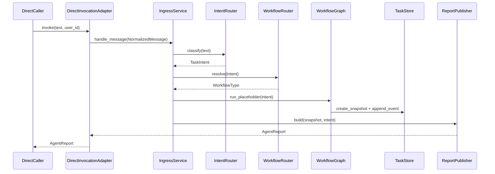

# Phase 1 详细实施计划

本文档是 Phase 1 编码前的详细实施计划。阶段概览见 [phase-01-foundation.md](phase-01-foundation.md)，目录设计见 [project-structure.md](../architecture/project-structure.md)。

## Scope

### 本阶段做什么

- 建立 `src/delivery_ops/` 最小可运行骨架。
- 实现直接调用入口 `DirectInvocationAdapter`。
- 实现统一输入边界 `IngressPort`。
- 实现规则型 `IntentRouter` 和 `WorkflowRouter`。
- 实现 InMemory `TaskStore` 与审计事件。
- 实现 `ReportPublisher`，返回结构化 `AgentReport`。
- 创建 `BugFixGraph` 与 `FeatureDevelopmentGraph` 占位实现。
- 编写单元测试和一条端到端集成测试。

### 本阶段不做什么

- 不实现 Hermes Adapter。
- 不自研微信、钉钉、飞书 Gateway。
- 不接入真实 Bug、需求、PRD、Figma、Repo 平台。
- 不接入 Cursor SDK 或 Claude Code。
- 不实现 Quality Gate。
- 不生成 Evidence Packet 或 Work Order。
- 不执行代码修改。

## Target Flow

```text
DirectInvocationAdapter
  -> IngressService
    -> IntentRouter
    -> WorkflowRouter
    -> BugFixGraph | FeatureDevelopmentGraph (placeholder)
    -> TaskStore
    -> ReportPublisher
  -> AgentReport
```




## Target Directory

Phase 1 只创建以下目录和文件：

```text
src/delivery_ops/
  __init__.py
  domain/
    __init__.py
    messages.py
    intents.py
    tasks.py
    reports.py
    ports.py
  application/
    __init__.py
    ingress_service.py
    intent_router.py
    workflow_router.py
    report_publisher.py
  adapters/
    __init__.py
    ingress/
      __init__.py
      direct_invocation.py
  graphs/
    __init__.py
    bugfix/
      __init__.py
      graph.py
    feature/
      __init__.py
      graph.py
  storage/
    __init__.py
    in_memory_task_store.py
  config/
    __init__.py
    settings.py
tests/
  conftest.py
  unit/
    domain/
      test_messages.py
      test_tasks.py
    application/
      test_intent_router.py
      test_workflow_router.py
      test_report_publisher.py
    storage/
      test_in_memory_task_store.py
  integration/
    test_direct_invocation_flow.py
pyproject.toml
```

暂不创建：

- `api/`
- `executors/`
- `quality/`
- `case_library/`
- `evals/`
- `observability/`

## Implementation Steps

### Step 1: 项目基础配置

创建 `pyproject.toml`，至少包含：

- Python `>=3.10`
- 包路径 `src/delivery_ops`
- 依赖：`pydantic>=2`, `pytest`, `pytest-asyncio`, `ruff`, `mypy`
- pytest 配置：`asyncio_mode = "auto"`, `testpaths = ["tests"]`

验收：

- `pytest` 可运行。
- `delivery_ops` 包可被测试导入。

### Step 2: 领域模型

#### `domain/messages.py`

```python
class NormalizedMessage(BaseModel):
    message_id: str
    user_id: str | None
    text: str
    source: Literal["direct"]
    created_at: datetime
```

规则：

- 不出现 Hermes、微信、钉钉等平台字段。
- `source` 首期只允许 `direct`。

#### `domain/intents.py`

```python
class TaskIntent(str, Enum):
    LIST_SERIOUS_BUGS = "list_serious_bugs"
    ANALYZE_BUG = "analyze_bug"
    GENERATE_FIX_ORDER = "generate_fix_order"
    LIST_FEATURE_TASKS = "list_feature_tasks"
    ANALYZE_FEATURE = "analyze_feature"
    GENERATE_FEATURE_ORDER = "generate_feature_order"
    TASK_STATUS = "task_status"
    CANCEL_TASK = "cancel_task"
    UNKNOWN = "unknown"

class WorkflowType(str, Enum):
    BUG_FIX = "bug_fix"
    FEATURE_DEVELOPMENT = "feature_development"
    SYSTEM = "system"
```

#### `domain/tasks.py`

```python
class TaskStatus(str, Enum):
    CREATED = "created"
    ANALYZING = "analyzing"
    WAITING_APPROVAL = "waiting_approval"
    EXECUTING = "executing"
    VERIFYING = "verifying"
    COMPLETED = "completed"
    FAILED = "failed"
    CANCELLED = "cancelled"

class TaskSnapshot(BaseModel):
    task_id: str
    workflow_type: WorkflowType
    intent: TaskIntent
    status: TaskStatus
    user_id: str | None
    input_text: str
    created_at: datetime
    updated_at: datetime

class TaskEvent(BaseModel):
    event_id: str
    task_id: str
    event_type: str
    payload: dict[str, str | int | float | bool | None]
    created_at: datetime
```

#### `domain/reports.py`

```python
class AgentReport(BaseModel):
    task_id: str
    workflow_type: WorkflowType
    intent: TaskIntent
    status: TaskStatus
    message: str
    details: dict[str, str | int | float | bool | None]
```

规则：

- `AgentReport` 是 Phase 1 唯一对外返回结构。
- 不在报告中塞平台原始 payload。

### Step 3: 端口接口

#### `domain/ports.py`

```python
class IngressPort(Protocol):
    async def handle_message(self, message: NormalizedMessage) -> AgentReport: ...

class DirectInvocationAdapter(Protocol):
    async def invoke(self, text: str, user_id: str | None = None) -> AgentReport: ...

class TaskStore(Protocol):
    async def create_snapshot(self, snapshot: TaskSnapshot) -> None: ...
    async def get_snapshot(self, task_id: str) -> TaskSnapshot | None: ...
    async def append_event(self, event: TaskEvent) -> None: ...

class WorkflowGraph(Protocol):
    async def run_placeholder(
        self,
        intent: TaskIntent,
        message: NormalizedMessage,
    ) -> TaskSnapshot: ...
```

规则：

- 所有外部依赖都通过 `Protocol` 暴露。
- Phase 1 不引入数据库接口。

### Step 4: Intent Router

文件：`application/intent_router.py`

首期使用规则匹配，不调用 LLM。

建议映射：


| 用户文本关键词                      | TaskIntent               |
| ---------------------------- | ------------------------ |
| 严重 bug / serious bug         | `list_serious_bugs`      |
| 分析第 N 个 bug / analyze bug    | `analyze_bug`            |
| 生成修复工单 / fix order           | `generate_fix_order`     |
| 新功能 / feature tasks          | `list_feature_tasks`     |
| 分析第 N 个新功能 / analyze feature | `analyze_feature`        |
| 生成开发工单 / feature order       | `generate_feature_order` |
| 查看任务 / task status           | `task_status`            |
| 停止任务 / cancel task           | `cancel_task`            |
| 其他                           | `unknown`                |


验收：

- 常见中文/英文短语可识别。
- 未识别意图返回 `unknown`，不抛异常。

### Step 5: Workflow Router

文件：`application/workflow_router.py`

映射规则：

- `list_serious_bugs`, `analyze_bug`, `generate_fix_order` -> `bug_fix`
- `list_feature_tasks`, `analyze_feature`, `generate_feature_order` -> `feature_development`
- `task_status`, `cancel_task` -> `system`
- `unknown` -> `system`

验收：

- Bug Fix 与 Feature Development 意图不会路由到同一图。

### Step 6: Task Store

文件：`storage/in_memory_task_store.py`

行为：

- `create_snapshot`：保存任务快照。
- `get_snapshot`：按 `task_id` 查询。
- `append_event`：追加审计事件。

首期要求：

- 使用 `dict[str, TaskSnapshot]` 和 `dict[str, list[TaskEvent]]`。
- 创建任务时自动写入 `task_created` 事件。
- 状态变化时写入 `task_status_changed` 事件。

验收：

- 同一 `task_id` 可查询快照。
- 事件按追加顺序保存。

### Step 7: Report Publisher

文件：`application/report_publisher.py`

职责：

- 根据 `TaskSnapshot` 和 `TaskIntent` 生成用户可读 `AgentReport`。
- Phase 1 只返回占位说明，不返回真实业务数据。

示例：

- `list_serious_bugs` -> `message="Bug Fix workflow placeholder ready"`
- `list_feature_tasks` -> `message="Feature workflow placeholder ready"`
- `unknown` -> `message="Intent not recognized"`

### Step 8: Graph Placeholders

#### `graphs/bugfix/graph.py`

职责：

- 接收 Bug Fix 相关意图。
- 创建 `workflow_type=bug_fix` 的任务快照。
- 将状态设为 `analyzing`。
- 返回占位结果，不访问外部平台。

#### `graphs/feature/graph.py`

职责：

- 接收 Feature Development 相关意图。
- 创建 `workflow_type=feature_development` 的任务快照。
- 将状态设为 `analyzing`。
- 返回占位结果，不访问外部平台。

规则：

- 两个 graph 文件不得共享状态模型。
- graph 只调用 `TaskStore`，不直接写存储细节。

### Step 9: Ingress Service

文件：`application/ingress_service.py`

职责：

1. 接收 `NormalizedMessage`
2. 调用 `IntentRouter`
3. 调用 `WorkflowRouter`
4. 分发到对应 graph placeholder
5. 调用 `ReportPublisher`
6. 返回 `AgentReport`

依赖注入：

- `intent_router`
- `workflow_router`
- `bugfix_graph`
- `feature_graph`
- `system_handler`（处理 `task_status` / `cancel_task`）
- `task_store`
- `report_publisher`

### Step 10: Direct Invocation Adapter

文件：`adapters/ingress/direct_invocation.py`

职责：

- 把 `(text, user_id)` 转成 `NormalizedMessage`
- 调用 `IngressService.handle_message`
- 返回 `AgentReport`

首期可提供简单 CLI 调用方式：

```python
await DirectInvocationAdapter(...).invoke("查看现在有哪些严重 bug")
```

## Application Wiring

建议后续在 `application/bootstrap.py` 或测试 `conftest.py` 中组装依赖：

```python
task_store = InMemoryTaskStore()
intent_router = IntentRouter()
workflow_router = WorkflowRouter()
report_publisher = ReportPublisher()
bugfix_graph = BugFixGraph(task_store=task_store)
feature_graph = FeatureGraph(task_store=task_store)
ingress_service = IngressService(
    intent_router=intent_router,
    workflow_router=workflow_router,
    bugfix_graph=bugfix_graph,
    feature_graph=feature_graph,
    task_store=task_store,
    report_publisher=report_publisher,
)
direct_adapter = DirectInvocationAdapter(ingress_service=ingress_service)
```

Phase 1 可以只在测试夹具中完成 wiring，不强制提供独立 CLI。

## Testing Plan

### 单元测试

#### `tests/unit/domain/`

- `NormalizedMessage` 必填字段校验。
- `TaskSnapshot` 状态枚举合法。
- `TaskEvent` payload 类型约束。

#### `tests/unit/application/test_intent_router.py`

- 识别 `list_serious_bugs`
- 识别 `list_feature_tasks`
- 识别 `task_status`
- 未识别文本返回 `unknown`

#### `tests/unit/application/test_workflow_router.py`

- Bug 意图路由到 `bug_fix`
- Feature 意图路由到 `feature_development`
- 系统意图路由到 `system`

#### `tests/unit/application/test_report_publisher.py`

- 不同意图生成不同占位 message
- `unknown` 返回明确提示

#### `tests/unit/storage/test_in_memory_task_store.py`

- 创建快照后可查询
- 追加事件后按顺序读取
- 查询不存在任务返回 `None`

### 集成测试

#### `tests/integration/test_direct_invocation_flow.py`

覆盖两条主路径：

1. `invoke("查看现在有哪些严重 bug")`
  - 返回 `workflow_type=bug_fix`
  - `intent=list_serious_bugs`
  - `status=analyzing`
  - `task_id` 非空
2. `invoke("查看当前迭代有哪些新功能")`
  - 返回 `workflow_type=feature_development`
  - `intent=list_feature_tasks`

额外覆盖：

- `invoke("查看任务 #123")` 走 system 流程
- `invoke("随便说句话")` 返回 `unknown` 但不崩溃

## Acceptance Checklist

- [ ] `src/delivery_ops/` 目录按本计划创建。
- [ ] 可以通过 `DirectInvocationAdapter.invoke()` 发起调用。
- [ ] 可以识别 Bug Fix、Feature Development、task status、cancel task 基础意图。
- [ ] `BugFixGraph` 与 `FeatureDevelopmentGraph` 为独立占位实现。
- [ ] 每次任务创建都写入 `TaskSnapshot` 和 `TaskEvent`。
- [ ] 返回结构化 `AgentReport`。
- [ ] 单元测试覆盖 intent、workflow、store、report。
- [ ] 至少 1 条集成测试跑通 direct invocation 全链路。
- [ ] 不依赖 Hermes、真实平台、执行器、Quality Gate。

## Risks And Constraints

- 入口策略必须保持为 `DirectInvocationAdapter + IngressPort`，不能把 Hermes 写进核心模型。
- `domain/` 不能提前引入 FastAPI route、LangGraph checkpoint、数据库 ORM。
- Intent Router 首期用规则匹配即可，不要把 LLM 分类写进 Phase 1 必做项。
- Graph 占位实现要预留 Phase 2/3 扩展点，但不能提前实现 Evidence Builder。
- `TaskStore` 必须从一开始保留审计事件，否则后续 Case Library 无数据基础。

## Next Phase Handoff

Phase 1 完成后，Phase 2 直接复用：

- `IngressService`
- `IntentRouter`
- `WorkflowRouter`
- `TaskStore`
- `AgentReport`

Phase 2 在 `graphs/bugfix/` 中替换占位逻辑，新增：

- `adapters/bug_sources/`
- `application/evidence/`
- `application/risk/`
- `application/work_orders/`

Phase 1 完成标志不是“能修 Bug”，而是“能稳定接收直接调用、识别意图、创建任务、返回占位报告”。