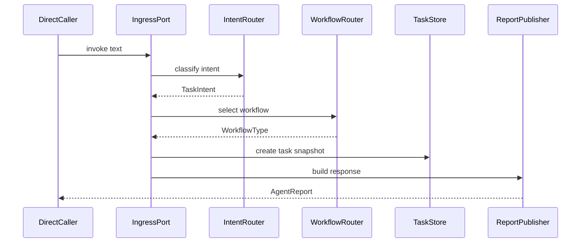

# Phase 1: Foundation And Direct Invocation

## Goal

搭建 Delivery Ops Agent 的最小可运行基础设施。首期入口采用直接调用，不实现 Hermes，也不自研完整 Gateway。

本阶段的目标是跑通一条稳定的内部链路：

```text
DirectInvocationAdapter -> IngressPort -> IntentRouter -> WorkflowRouter -> TaskStore -> ReportPublisher
```

## Scope

- 项目基础结构。
- 统一输入模型。
- 直接调用入口。
- Intent Router。
- Workflow Router。
- Task Store。
- Report Publisher。
- Fake/InMemory Adapter。
- 基础单元测试。

## Modules

项目采用 `src/delivery_ops/` 标准 Python 包布局。完整目录设计见 `docs/architecture/project-structure.md`。

Phase 1 只需要先创建最小可运行目录：

```text
src/
  delivery_ops/
    __init__.py
    adapters/
      ingress/
    application/
    domain/
    graphs/
      bugfix/
      feature/
    storage/
    config/
tests/
  unit/
  integration/
```

核心模块：

- `DirectInvocationAdapter`：首期真实入口，用于 CLI、本地脚本、测试或内部 API。
- `IngressPort`：核心系统的统一输入边界。
- `IntentRouter`：将用户文本映射为标准意图。
- `WorkflowRouter`：选择 Bug Fix 或 Feature Development 工作流。
- `TaskStore`：保存任务状态和审计事件。
- `ReportPublisher`：返回任务结果，首期可以只返回结构化对象。

暂不创建或只保留占位的目录：

- `api/`：等需要 FastAPI HTTP 入口时再补。
- `executors/`：Phase 4 接入 Cursor SDK / Claude Code 时创建。
- `quality/`：Phase 5 独立验收时创建。
- `case_library/` 和 `evals/`：Phase 6 历史案例和评估时创建。
- `observability/`：需要日志、trace、metrics 标准化时创建。

## Data Models

首期最小模型：

- `NormalizedMessage`
- `TaskIntent`
- `WorkflowType`
- `TaskSnapshot`
- `TaskStatus`
- `TaskEvent`
- `AgentReport`

建议状态枚举：

- `created`
- `analyzing`
- `waiting_approval`
- `executing`
- `verifying`
- `completed`
- `failed`
- `cancelled`

## Interfaces

首期接口只定义稳定边界，不绑定具体平台。

```python
from typing import Protocol


class IngressPort(Protocol):
    async def handle_message(self, message: "NormalizedMessage") -> "AgentReport": ...


class DirectInvocationAdapter(Protocol):
    async def invoke(self, text: str, user_id: str | None = None) -> "AgentReport": ...


class TaskStore(Protocol):
    async def create_snapshot(self, snapshot: "TaskSnapshot") -> None: ...
    async def get_snapshot(self, task_id: str) -> "TaskSnapshot | None": ...
    async def append_event(self, event: "TaskEvent") -> None: ...
```

## Flow



## Acceptance Criteria

- 可以通过直接调用传入一句用户文本。
- 可以识别 Bug Fix、Feature Development、task status、cancel task 等基础意图。
- 可以创建任务快照并记录审计事件。
- 可以根据意图选择 `BugFixGraph` 或 `FeatureDevelopmentGraph` 占位。
- 可以返回结构化 `AgentReport`。
- 单元测试覆盖 intent routing、workflow routing、task store。

## Out Of Scope

- 不实现 Hermes Adapter。
- 不实现微信、钉钉、飞书 Gateway。
- 不调用真实 Bug、需求、PRD、Figma、Repo 平台。
- 不接入 Cursor SDK 或 Claude Code。
- 不执行代码修改。

## Skills To Use

项目专属 skill：

- `delivery-ops-architecture`：固定双工作流隔离、入口策略、执行器边界和风险策略。
- `delivery-ops-work-order`：固定 Evidence Packet 与 Work Order 的字段和输出边界。
- `delivery-ops-quality-gate`：固定执行后独立验收规则，避免执行器自证成功。

首期直接安装的开源 skill：

```bash
npx skills add https://github.com/siviter-xyz/dot-agent --skill python
npx skills add https://github.com/mindrally/skills --skill fastapi-python
npx skills add https://github.com/wshobson/agents --skill python-testing-patterns
npx skills add https://github.com/langconfig/langconfig --skill langgraph-workflows
```

引入原因：

- `python`：统一 Python typing、Protocol、依赖注入、模块职责和 pytest 结构。
- `fastapi-python`：约束 FastAPI、Pydantic v2、async/await、依赖注入和错误处理。
- `python-testing-patterns`：支撑 pytest、fixture、mock 外部平台、async 测试和集成测试。
- `langgraph-workflows`：支撑 LangGraph 状态机、条件路由、循环控制、checkpoint 和 human-in-the-loop 编排。

安装备注：

- `langchain-architecture` 原计划使用 `npx skills add https://github.com/smithery/ai --skill langchain-architecture`。
- 当前环境通过 HTTPS、SSH、GitHub shorthand 均无法 clone `smithery/ai`，因此首期使用 `langgraph-workflows` 作为可安装替代。

## Next Phase Handoff

Phase 2 需要复用本阶段的 `IngressPort`、`TaskStore`、`WorkflowRouter`，并在 `BugFixGraph` 中接入 Bug 平台 Fake Adapter、严重 Bug 排序、Bug Evidence Packet 和 Fix Work Order。
