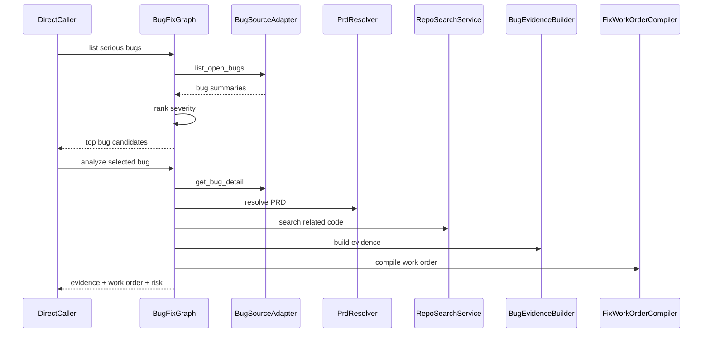

# Phase 2: Bug Fix Readonly MVP

## Goal

实现 Bug Fix 只读 MVP：用户可以查询严重 Bug，选择某个 Bug 后生成 Bug Evidence Packet 和 Fix Work Order。

本阶段不修改代码，不调用执行器。

## Scope

- Bug 平台 Adapter。
- 严重 Bug 排序。
- Bug 详情读取。
- PRD 关联解析。
- Repo 相关代码搜索。
- Bug Evidence Packet。
- Fix Work Order。
- Bug Fix 风险判断。

## Modules

- `BugSourceAdapter`：读取 Bug 列表、详情和评论。
- `BugSeverityRanker`：对开放 Bug 排序。
- `PrdResolver`：从 Bug 字段、描述、评论或映射表中定位 PRD。
- `RepoSearchService`：根据模块名、页面名、接口名、错误信息搜索代码。
- `BugEvidenceBuilder`：合成 Bug 证据包。
- `BugRiskJudge`：判断是否适合自动执行。
- `FixWorkOrderCompiler`：生成 Cursor/Claude 可读的修复工单。

## Data Models

核心模型：

- `BugSummary`
- `BugDetail`
- `BugSeverityScore`
- `PrdRef`
- `PrdDocument`
- `CodeHit`
- `BugEvidencePacket`
- `BugRiskAssessment`
- `FixWorkOrder`

`BugEvidencePacket` 建议字段：

- `bug_facts`
- `prd_claims`
- `code_facts`
- `conflicts`
- `unknowns`
- `suggested_scope`

## Interfaces

```python
from typing import Protocol


class BugSourceAdapter(Protocol):
    async def list_open_bugs(self) -> list["BugSummary"]: ...
    async def get_bug_detail(self, bug_id: str) -> "BugDetail": ...


class BugEvidenceBuilder(Protocol):
    async def build(self, bug: "BugDetail") -> "BugEvidencePacket": ...


class FixWorkOrderCompiler(Protocol):
    async def compile(self, packet: "BugEvidencePacket") -> "FixWorkOrder": ...
```

## Flow



## Acceptance Criteria

- 能列出 Top 3 严重 Bug。
- 能读取指定 Bug 的详情。
- 能定位或标记缺失 PRD。
- 能根据 Bug 信息搜索可能相关代码。
- 能输出 Bug Evidence Packet。
- 能输出 Fix Work Order。
- 能给出 `low`、`medium`、`high` 风险等级。
- 不产生任何代码修改。

## Out Of Scope

- 不执行修复。
- 不创建分支或 worktree。
- 不调用 Cursor SDK / Claude Code。
- 不做完整回归验证。
- 不实现真实消息通道。

## Next Phase Handoff

Phase 3 需要复用 PRD、Repo 搜索和 Work Order 生成模式，并为 Feature Development 新增需求、Figma、依赖和验收标准维度。
