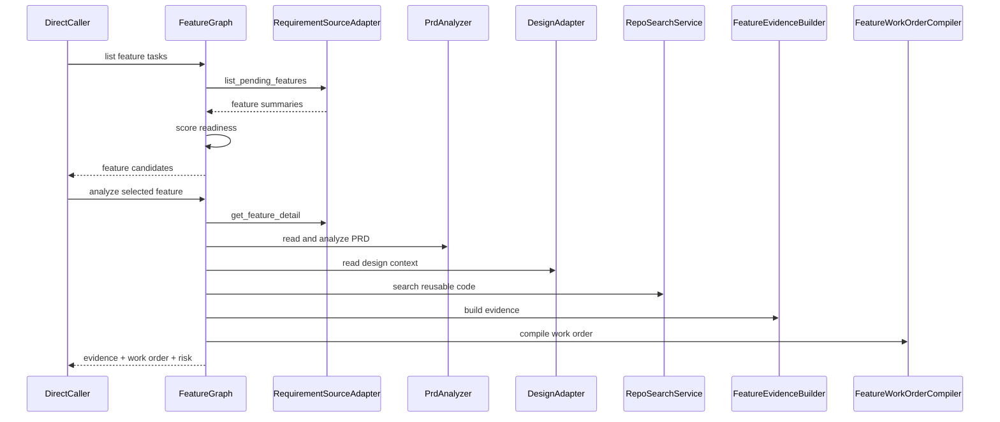

# Phase 3: Feature Development Readonly MVP

## Goal

实现 Feature Development 只读 MVP：用户可以查询当前迭代可开发需求，选择某个需求后读取 PRD、Figma 和代码上下文，生成 Feature Evidence Packet 和 Feature Work Order。

本阶段不修改代码，不调用执行器。

## Scope

- Requirement Source Adapter。
- Feature readiness 排序。
- PRD 读取和验收标准提取。
- Figma 设计上下文读取。
- Repo 可复用代码搜索。
- Feature Evidence Packet。
- Feature Work Order。
- Feature 风险判断。

## Modules

- `RequirementSourceAdapter`：读取待开发需求列表和详情。
- `FeatureReadinessRanker`：根据优先级、PRD 完整度、Figma 完整度、依赖清晰度排序。
- `PrdAnalyzer`：提取范围、验收标准、边界条件和依赖。
- `DesignContextService`：读取 Figma 设计节点、状态、组件和注释。
- `DependencyMapper`：识别接口、数据、组件、权限和跨系统依赖。
- `FeatureEvidenceBuilder`：合成新功能证据包。
- `FeatureRiskPlanner`：判断风险并建议拆分。
- `FeatureWorkOrderCompiler`：生成新功能开发工单。

## Data Models

核心模型：

- `FeatureSummary`
- `FeatureDetail`
- `FeatureReadinessScore`
- `PrdDocument`
- `DesignRef`
- `DesignContext`
- `DependencyMap`
- `FeatureEvidencePacket`
- `FeatureRiskAssessment`
- `FeatureWorkOrder`

`FeatureEvidencePacket` 建议字段：

- `requirement_facts`
- `prd_claims`
- `figma_claims`
- `code_facts`
- `dependencies`
- `conflicts`
- `open_questions`
- `suggested_scope`

## Interfaces

```python
from typing import Protocol


class RequirementSourceAdapter(Protocol):
    async def list_pending_features(self) -> list["FeatureSummary"]: ...
    async def get_feature_detail(self, requirement_id: str) -> "FeatureDetail": ...


class DesignAdapter(Protocol):
    async def resolve_design(self, source: "FeatureDetail") -> "DesignRef | None": ...
    async def read_design_context(self, design_ref: "DesignRef") -> "DesignContext": ...


class FeatureWorkOrderCompiler(Protocol):
    async def compile(self, packet: "FeatureEvidencePacket") -> "FeatureWorkOrder": ...
```

## Flow



## Acceptance Criteria

- 能列出当前迭代待开发需求。
- 能读取指定需求详情。
- 能读取或标记缺失 PRD。
- 能读取或标记缺失 Figma 设计。
- 能识别可复用代码和潜在依赖。
- 能输出 Feature Evidence Packet。
- 能输出 Feature Work Order。
- 能标记 PRD/Figma 冲突和未确认问题。
- 不产生任何代码修改。

## Out Of Scope

- 不执行新功能开发。
- 不做 UI 代码生成。
- 不做接口联调。
- 不创建分支或 worktree。
- 不实现真实消息通道。

## Next Phase Handoff

Phase 4 需要复用 Feature Work Order，并在人工确认后接入 Cursor SDK / Claude Code 执行器。
