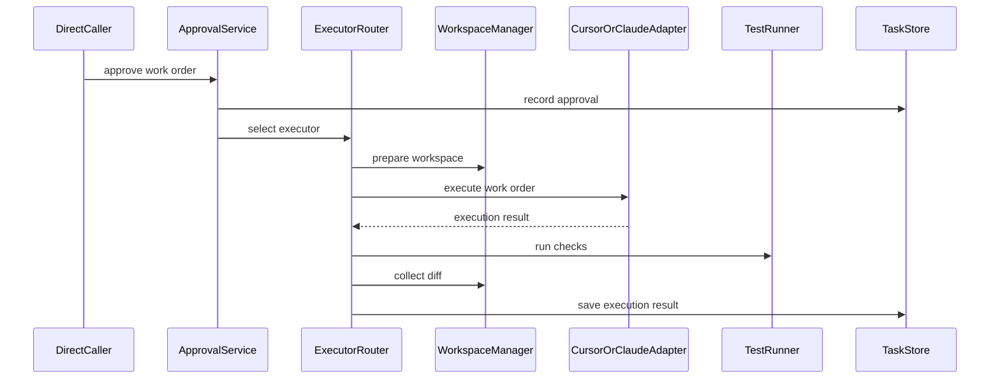

# Phase 4: Executor

## Goal

在用户确认后，将低/中风险的 Fix Work Order 或 Feature Work Order 交给 Cursor SDK 或 Claude Code 执行。

执行器只负责实现工单，不负责判断任务是否成功。

## Scope

- Executor Router。
- Cursor SDK Adapter。
- Claude Code Adapter。
- 人工确认机制。
- 分支或 worktree 隔离。
- 执行状态追踪。
- 基础 lint/typecheck/test 运行。
- 执行结果摘要。

## Modules

- `ApprovalService`：记录用户确认和确认上下文。
- `ExecutorRouter`：根据任务类型、风险等级和执行环境选择执行器。
- `CursorSdkAdapter`：执行需要 IDE/代码上下文的任务。
- `ClaudeCodeAdapter`：执行小型后端、脚本或独立修复任务。
- `WorkspaceManager`：创建分支或 worktree，隔离执行环境。
- `ExecutionTracker`：保存执行状态、日志、changed files、diff summary。
- `TestRunner`：运行基础测试命令。

## Data Models

核心模型：

- `ApprovalDecision`
- `ExecutionPlan`
- `ExecutorType`
- `ExecutionStatus`
- `ExecutionResult`
- `ChangedFile`
- `TestResult`
- `DiffSummary`

建议执行状态：

- `queued`
- `preparing_workspace`
- `running`
- `testing`
- `completed`
- `failed`
- `cancelled`

## Interfaces

```python
from typing import Protocol


class CodeExecutorAdapter(Protocol):
    async def execute(self, work_order: "WorkOrder") -> "ExecutionResult": ...


class WorkspaceManager(Protocol):
    async def prepare(self, task_id: str) -> "WorkspaceRef": ...
    async def collect_diff(self, workspace: "WorkspaceRef") -> "DiffSummary": ...


class TestRunner(Protocol):
    async def run(self, workspace: "WorkspaceRef", commands: list[str]) -> "TestResult": ...
```

## Flow



## Acceptance Criteria

- `low` 风险任务可以在确认后执行。
- `medium` 风险任务必须二次确认后执行。
- `high` 风险任务不执行，只返回拆分建议和待确认问题。
- 执行环境与主工作区隔离。
- 执行后返回 changed files、diff summary、test result。
- 执行失败时返回失败原因和下一步建议。
- 执行器不能直接标记任务验收通过。

## Out Of Scope

- 不让执行器自证成功。
- 不跳过人工确认。
- 不对高风险任务自动改代码。
- 不实现完整 CI/CD。
- 不实现 Gateway 或 Hermes 消息接入。

## Next Phase Handoff

Phase 5 需要消费 `ExecutionResult`、`DiffSummary` 和 `TestResult`，并由独立 Quality Gate 判断是否满足 Fix Work Order 或 Feature Work Order。
