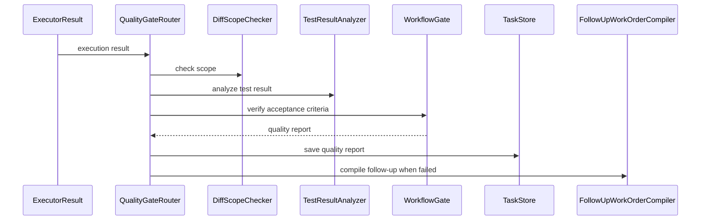

# Phase 5: Quality Gate

## Goal

实现独立验收层。执行器完成代码修改后，由 Quality Gate 判断结果是否满足工单，而不是让 Cursor SDK 或 Claude Code 自证成功。

Bug Fix 使用 `BugVerificationGate`，Feature Development 使用 `FeatureAcceptanceGate`。

## Scope

- Diff scope 检查。
- Forbidden files 检查。
- lint/typecheck/test 结果读取。
- Work Order acceptance criteria 对照。
- Bug Verification Gate。
- Feature Acceptance Gate。
- 二次修复工单生成。
- 验收报告保存。

## Modules

- `QualityGateRouter`：根据任务类型选择验收逻辑。
- `DiffScopeChecker`：检查改动是否只发生在允许范围。
- `ForbiddenChangeChecker`：检查是否触碰禁止文件或禁止模块。
- `TestResultAnalyzer`：解析 lint、typecheck、test 结果。
- `BugVerificationGate`：验证 Bug 是否被修复且不引入回归。
- `FeatureAcceptanceGate`：验证新功能是否覆盖 PRD/Figma 验收项。
- `FollowUpWorkOrderCompiler`：生成二次修复或补充开发工单。

## Data Models

核心模型：

- `QualityReport`
- `QualityStatus`
- `FailedCriterion`
- `ScopeViolation`
- `ForbiddenChange`
- `RegressionRisk`
- `FollowUpWorkOrder`

建议验收状态：

- `pass`
- `fail`
- `needs_human_review`
- `blocked`

## Interfaces

```python
from typing import Protocol


class QualityGate(Protocol):
    async def verify(
        self,
        work_order: "WorkOrder",
        execution_result: "ExecutionResult",
    ) -> "QualityReport": ...


class DiffScopeChecker(Protocol):
    async def check(self, diff: "DiffSummary", allowed_scope: list[str]) -> list["ScopeViolation"]: ...


class FollowUpWorkOrderCompiler(Protocol):
    async def compile(self, report: "QualityReport") -> "FollowUpWorkOrder": ...
```

## Flow



## Acceptance Criteria

- 能识别 diff 越界。
- 能识别 forbidden files 修改。
- 能识别 lint/typecheck/test 失败。
- 能对照 Fix Work Order 验证回归修复。
- 能对照 Feature Work Order 验证验收项覆盖。
- 验收失败时能输出失败项和二次修复工单。
- 高风险或不确定结果能标记 `needs_human_review`。

## Out Of Scope

- 不重新执行完整开发任务。
- 不绕过测试失败。
- 不把执行器输出直接视为验收通过。
- 不实现完整产品人工验收平台。

## Next Phase Handoff

Phase 6 需要保存 `QualityReport`、失败项、二次修复工单和人工 review 结论，用于 Case Library 与 Evals。
