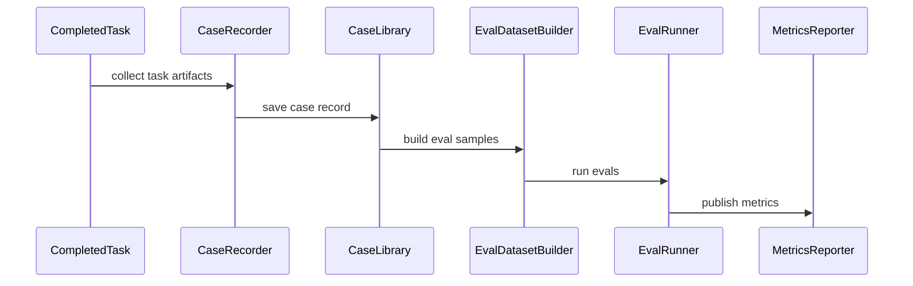

# Phase 6: Case Library And Evals

## Goal

沉淀 Bug Fix 和 Feature Development 的历史案例，建立可评估的数据集，用于持续改进排序、上下文定位、工单质量和一次验收通过率。

Bug Fix 与 Feature Development 需要分别维护 Case Library 和 Evals。

## Scope

- Bug Fix Case Library。
- Feature Case Library。
- Evals 数据集。
- PRD/Figma 冲突记录。
- 一次修复成功率统计。
- 新功能一次验收通过率统计。
- Work Order 质量评估。
- 上下文定位准确率评估。

## Modules

- `CaseRecorder`：保存任务全过程记录。
- `BugFixCaseLibrary`：沉淀 Bug 原文、复现、证据、修复、验收结果。
- `FeatureCaseLibrary`：沉淀需求、PRD、Figma、实现、验收结果。
- `EvalDatasetBuilder`：从历史案例生成评估样本。
- `EvalRunner`：定期评估排序、检索、工单生成和验收质量。
- `MetricsReporter`：统计成功率、失败原因和人工 review 结论。
- `ConflictDetector`：记录 PRD 与 Figma 不一致的问题。

## Data Models

核心模型：

- `CaseRecord`
- `BugFixCase`
- `FeatureCase`
- `EvalSample`
- `EvalResult`
- `ReviewConclusion`
- `ConflictRecord`
- `SuccessMetric`

建议记录字段：

- 原始用户消息。
- Bug 原文或 Feature 原文。
- 关联 PRD。
- 关联 Figma。
- Evidence Packet。
- Work Order。
- 风险判断。
- 执行结果。
- diff summary。
- 测试结果。
- Quality Report。
- 人工 review 结论。
- 是否一次修复或一次验收成功。

## Interfaces

```python
from typing import Protocol


class CaseRecorder(Protocol):
    async def record(self, task_id: str) -> "CaseRecord": ...


class EvalDatasetBuilder(Protocol):
    async def build_samples(self, cases: list["CaseRecord"]) -> list["EvalSample"]: ...


class EvalRunner(Protocol):
    async def run(self, samples: list["EvalSample"]) -> list["EvalResult"]: ...
```

## Flow



## Acceptance Criteria

- 能分别保存 Bug Fix 和 Feature Development 案例。
- 能记录 PRD/Figma 冲突。
- 能统计 Bug 一次修复成功率。
- 能统计 Feature 一次验收通过率。
- 能评估严重 Bug 排序是否合理。
- 能评估 Feature readiness 排序是否合理。
- 能评估代码定位是否准确。
- 能评估 Work Order 是否足够让执行器一次完成任务。

## Out Of Scope

- 不训练模型。
- 不自动修改历史案例。
- 不把 Evals 结果直接用于生产决策。
- 不替代人工 review。

## Next Phase Handoff

完成 Phase 6 后，可以进入迭代优化阶段：接入真实平台 Adapter、完善 Hermes Adapter、按业务场景扩充 Evals，并基于指标优化 ranker、retriever 和 work order compiler。
